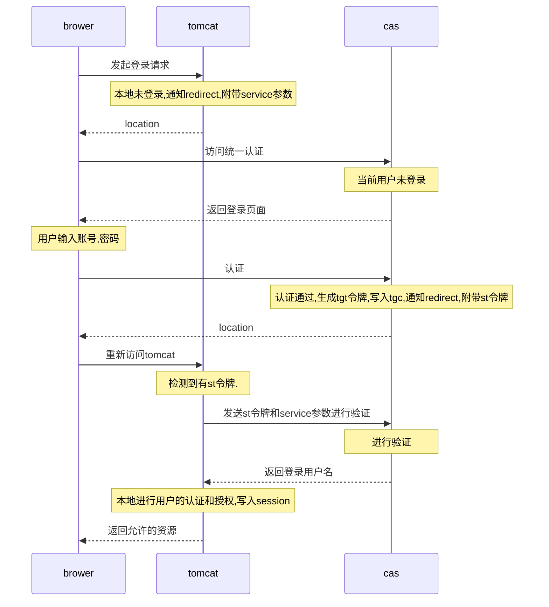
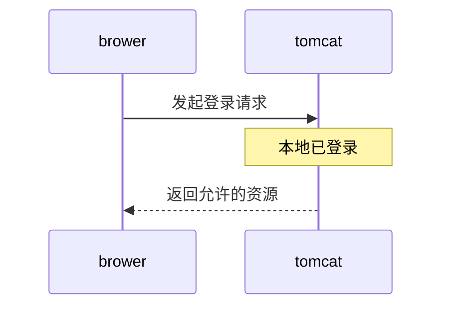
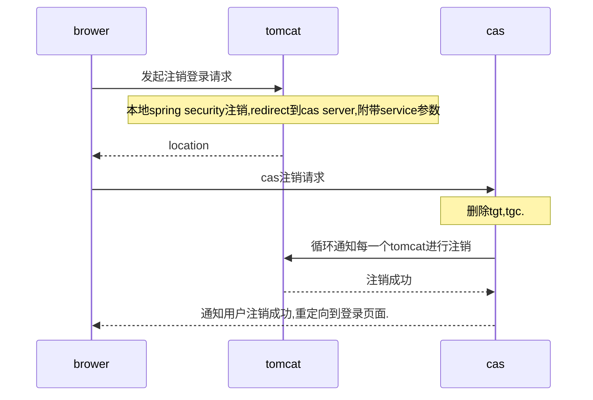

---
date: 2018-01-13 20:26:11
title: cas认证时序图
tags: [cas,eap]
---

### 名次解释

|名词|解释|
--|--
brower|用户的浏览器|
tomcat|业务所在的web服务器|
cas|cas服务器|
service参数|业务方的访问地址,即tomcat的访问地址,在集群中应该是nginx的对外地址,最终应该是用户浏览器访问业务的地址|
tgt|cas服务器根据账号的用户名密码等信息进行加密生成的凭证,单机随cas应用存储在同一个jvm中,集群应该存储在redis,memcached等高性能分布式存储系统中.一个用户对应一个tgt|
tgc|可以理解为tgt的index,即tgt得主键,存储在用户浏览器的cookie中.随用户登录而生成,随用户注销而删除(还有cookie过期时间)
location|重定向|
st令牌|根据tgt生成的一次性的访问令牌,业务方发送st令牌和service参数访问cas服务端进行校验|
spring security|spring 家族的一款权限管理组件,基于servlet规范,类似的有apache 的shiro.都只能很好的进行垂直权限管理|

### 用户第一次登录

### 第二次登录

### 用户注销登录
