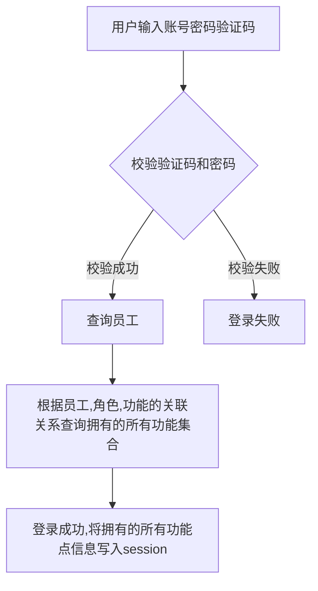
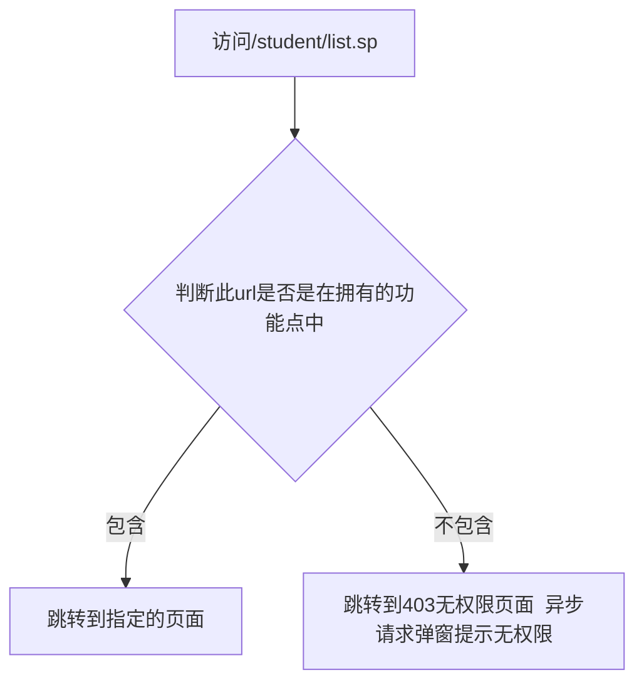

## 数据库表说明

| 涉及到的表                    | 类名                                            | 描述       |
| ----------------------------- | ----------------------------------------------- | ---------- |
| t_system_system_staff         | com.hfvast.platform.system.SystemStaffEntity    | 员工       |
| t_system_system_role          | com.hfvast.platform.system.SystemRoleEntity     | 角色       |
| t_system_system_role_staff    | com.hfvast.platform.system.SystemRoleStaff      | 角色对员工 |
| t_system_system_role_function | com.hfvast.platform.system.SystemRoleFunction   | 角色对功能 |
| t_system_system_function      | com.hfvast.platform.system.SystemFunctionEntity | 功能       |
| t_system_system_menu          | com.hfvast.platform.system.SystemMenuEntity     | 菜单       |

一些说明:

使用的开源框架: spring security 4

默认所有的Requestmapping 对应的url都是受管理的url 都必须要登录才能访问不允许匿名访问

功能: 一个后端的url对应一个功能点 更具体的来说 一个@RequestMapping对应的前端访问的url就是一个功能(/listController)

```java
@Controller
@RequestMapping(value = "/")
public class CommonController {
    @Autowired
    private RequestMappingHandlerMapping handlerMapping;
    
    @RequestMapping(value = "/listController")
    public Object listController() throws IOException {
        Map<RequestMappingInfo, HandlerMethod> map = handlerMapping.getHandlerMethods();

        return map;
    }
}
```


可以看到 一个员工可以赋予多个角色  每个角色关联多个功能  一个菜单关联一个功能.


eg:

```mermaid

graph LR
张三-->只读管理员
张三-->系统管理员
李四-->只读管理员
只读管理员-->/student/list.sp__查看所有学生
只读管理员-->/student/info.sp?id=1__查看学生具体信息
系统管理员-->/student/list.sp__查看所有学生
系统管理员-->/student/info.sp?id=1__查看学生具体信息
系统管理员-->/student/add.sp__添加学生
系统管理员-->/student/modify.sp?id=1__修改学生信息

```


有员工(张三,李四) 角色(只读管理员,系统管理员) 功能点四个

当进行登录时,



当访问其他功能时



## 关于添加菜单

菜单和功能是一对一的关系 添加菜单后 必须给菜单绑定功能 如果这个人有菜单对应的功能的权限,才会看到这个菜单,反之,即使添加了菜单,没有权限也看不到菜单.

要看到菜单1. 有对应的功能的权限 2. 父菜单是有效状态


想要某个员工能正常访问某个页面   

1. 将此功能关联到一个角色 即这个角色包含这个功能点
2. 给员工授予这个角色


## 关于页面根据权限显示隐藏

如果页面上的按钮,链接 对于有的角色不显示,那么这里就需要用到spring security 的taglib了.


前提:
1. 添加security的命名声明`<%@ taglib prefix="sec" uri="http://www.springframework.org/security/tags" %>`
2. 添加jstl 声明`<%@ taglib prefix="c" uri="http://java.sun.com/jsp/jstl/core" %>`

使用:
```xml
<sec:authorize access="hasRole('123')">
    只有拥有角色123的用户才能看到这句话! 这里可以放置dom元素
</sec:authorize>

<sec:authorize access="hasAnyRole('123','系统管理员')">
    该用户有123角色或者有系统管理员之中的任一即可看到,这里可以放置dom元素
</sec:authorize>

<sec:authorize access="hasAuthority('system/staff/add.sp')">
    通过 access="hasAuthority('system/staff/add.sp')" 显示
</sec:authorize>

<!--显示当前登录用户的姓名-->
<sec:authentication property="name" />

```


