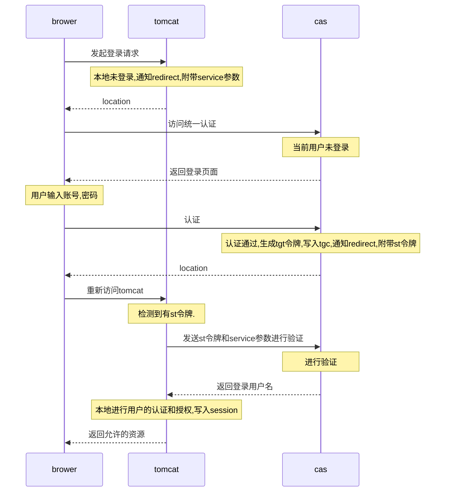
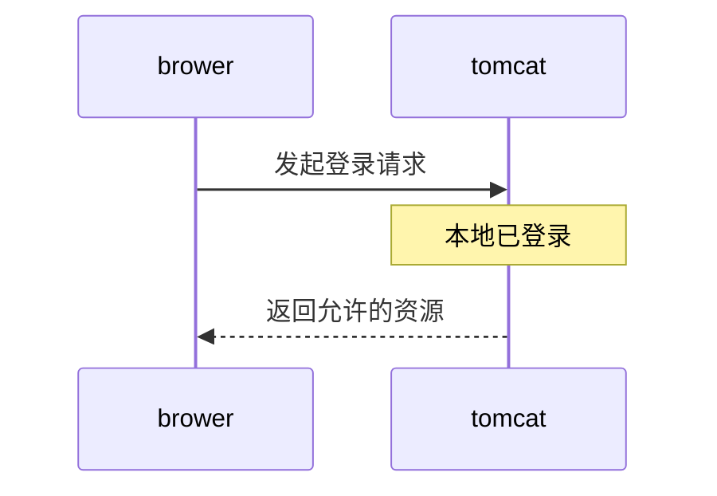
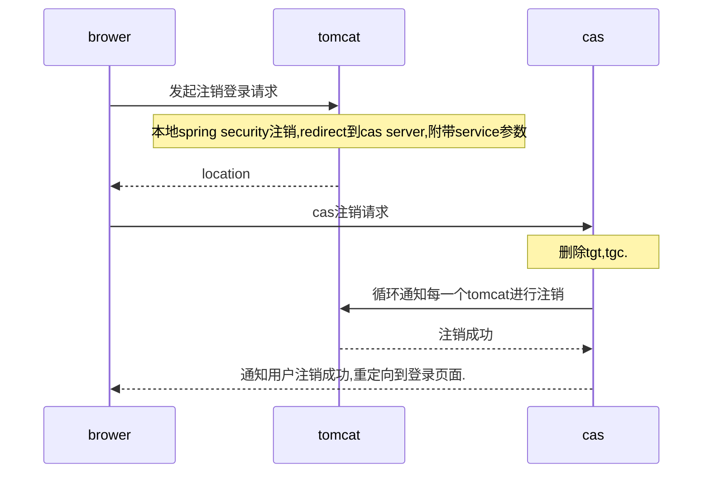

## 单点登录

实现方案：

1. 基于同一级域名多二级域名（二级域名写一级域名的cookie）。
2. iframe方式（IE安全性兼容性问题）。
3. 基于单独的sso系统负责cookie的管理维护。

## CAS简单介绍

### 前言

集中式认证服务（英语：Central Authentication Service，缩写CAS）是一种针对万维网的单点登录协议。它的目的是允许一个用户访问多个应用程序，而只需提供一次凭证（如用户名和密码）。它还允许web应用程序在没有获得用户的安全凭据（如密码）的情况下对用户进行身份验证。“CAS”也指实现了该协议的软件包。

### 描述

CAS 协议涉及到至少三个方面：客户端Web浏览器、Web应用请求的身份验证和CAS服务器。它还可能涉及一个后台服务（例如数据库服务器），它并没有自己的HTTP接口，但与一个Web应用程序进行通信。

当客户端访问访问应用程序，请求身份验证时，应用程序重定向到CAS。CAS验证客户端是否被授权，通常通过在数据库对用户名和密码进行检查（例如Kerberos、LDAP或Active Directory）。

如果身份验证成功，CAS令客户端返回到应用程序，并传递身份验证票（Service ticket）。然后，应用程序通过安全连接连接CAS，并提供自己的服务标识和验证票。之后CAS给出了关于特定用户是否已成功通过身份验证的应用程序授信信息。

CAS 允许通过代理服务器进行多层身份验证。后端服务（如数据库或邮件服务器）可以组成CAS，通过从Web应用程序接收到的信息验证用户是否被授权。因此，网页邮件客户端和邮件服务器都可以实现CAS。

### 历史

CAS是由耶鲁大学[1]的Shawn Bayern创始的，后来由耶鲁大学的Drew Mazurek维护。CAS1.0实现了单点登录。 CAS2.0引入了多级代理认证（Multi-tier proxy authentication）。CAS其他几个版本已经有了新的功能。

2004年12月，CAS成为Jasig[2]的一个项目，2008年该组织负责CAS的维护和发展。CAS原名“耶鲁大学CAS”，现在则被称为“Jasig CAS”。

2006年12月，安德鲁·W·梅隆基金会授予耶鲁大学第一届梅隆技术协作奖，颁发50000美元的奖金对耶鲁大学开发CAS进行奖励。[3]颁奖之时，CAS在“数以百计的大学校园”中使用。

## 统一门户

### 名次解释

|名词|解释|
--|--
brower|用户的浏览器|
tomcat|业务所在的web服务器|
cas|cas服务器|
service参数|业务方的访问地址,即tomcat的访问地址,在集群中应该是nginx的对外地址,最终应该是用户浏览器访问业务的地址|
tgt|cas服务器根据账号的用户名密码等信息进行加密生成的凭证,单机随cas应用存储在同一个jvm中,集群应该存储在redis,memcached等高性能分布式存储系统中.一个用户对应一个tgt|
tgc|可以理解为tgt的index,即tgt得主键,存储在用户浏览器的cookie中.随用户登录而生成,随用户注销而删除(还有cookie过期时间)
location|重定向|
st令牌|根据tgt生成的一次性的访问令牌,业务方发送st令牌和service参数访问cas服务端进行校验|
spring security|spring 家族的一款权限管理组件,基于servlet规范,类似的有apache 的shiro.都只能很好的进行垂直权限管理|

### 用户第一次登录


### 第二次登录


### 用户注销登录


### 涉及接口说明

* 接入应用:http://yingyong
* cas服务:http://casyingyong

|接口名|客户端|服务端|接口路径|请求参数|返回参数|备注|
|-----|-----|-----|------|-------|-------|---|
|登录接口|浏览器|cas服务|http://casyingyong/cas/login?service=http://yingyong||TGC(cookie)|业务系统检测到没有登录，重定向到此地址|
|二次登录接口|浏览器|接入应用|http://yingyong/j_spring_cas_security_check|ST||cas验证成功后，重定向到业务地址|
|登录验证接口|接入应用|cas服务|http://casyingyong/cas|service,ST|用户名|业务向cas询问校验TGC与service的一致性|
|登出接口|浏览器|cas服务|http://casyingyong/cas/logout?service=http://yingyong|TGC(cookie)||cas session注销|


### 接入

统一门户基于开源的cas（v3.5.2）深度改造而来.目前提供有`java`,`php`,`.net`语言的sdk。

以下针对java语言接入做介绍。

#### 添加依赖

```xml
<dependency>
    <groupId>org.jasig.cas.client</groupId>
    <artifactId>cas-client-core</artifactId>
    <version>3.4.1</version>
</dependency>
```

#### 基于spring mvc4.x && spring security4.x xml config 接入

**web.xml**

```xml
<?xml version="1.0" encoding="UTF-8"?>

<web-app version="3.0"
         xmlns="http://java.sun.com/xml/ns/javaee"
         xmlns:xsi="http://www.w3.org/2001/XMLSchema-instance"
         xsi:schemaLocation="http://java.sun.com/xml/ns/javaee
        http://java.sun.com/xml/ns/javaee/web-app_3_0.xsd">

    <display-name>Archetype Created Web Application</display-name>

    <filter>
        <filter-name>springSecurityFilterChain</filter-name>
        <filter-class>org.springframework.web.filter.DelegatingFilterProxy</filter-class>
    </filter>
    <filter-mapping>
        <filter-name>springSecurityFilterChain</filter-name>
        <url-pattern>/*</url-pattern>
    </filter-mapping>
</web-app>
```

**spring-security.xml**

```xml

<?xml version="1.0" encoding="UTF-8"?>

<beans:beans xmlns="http://www.springframework.org/schema/security"
    xmlns:beans="http://www.springframework.org/schema/beans"
    xmlns:xsi="http://www.w3.org/2001/XMLSchema-instance"
    xsi:schemaLocation="http://www.springframework.org/schema/beans
                        http://www.springframework.org/schema/beans/spring-beans-4.3.xsd
                        http://www.springframework.org/schema/security
                        http://www.springframework.org/schema/security/spring-security-4.2.xsd">

    <!-- <debug/> -->


    <!--开启方法controller级别 的安全认证-->
    <global-method-security pre-post-annotations="enabled" />

    <!-- 此目录下不需要过滤 -->
    <http pattern="/**/*.js" security="none"/>
    <http pattern="/**/*.css" security="none"/>
    <http pattern="/index.html" security="none"/>
    <http pattern="/**/*.htm" security="none"/>
    <http pattern="/**/*.jpg" security="none"/>
    <http pattern="/**/*.gif" security="none"/>
    <http pattern="/**/*.png" security="none"/>

    <!--<http pattern="/system/**" security="none"/>-->
    <http pattern="/eg/**" security="none"/>
    <http pattern="/upload/**" security="none"/>
	  <http pattern="/list.sp" security="none"/>
	  <http pattern="/favicon.ico" security="none"/>
    <http pattern="/**/query_validation_information.sp" security="none"/>
    <http pattern="/media/**" security="none"/>
    <http pattern="/common/postmessage" security="none"/>
    <http pattern="/imageUpload/**" security="none"/>
    <http pattern="/login.jsp" security="none"/>
    <http pattern="/index.jsp" security="none"/>
    <http pattern="/editor/**" security="none"/>

    <!--entry-point-ref : 指定登录入口为cas
        auto-config =true时，会配置十个默认过滤器
            SecurityContextPersistenceFilter,LogoutFilter,UsernamePasswordAuthenticationFilter,BasicAuthenticationFilter
            RequestCacheAwareFilter,SecurityContextHolderAwareRequestFilter,AnonymousAuthenticationFilter,
            SessionManagementFilter,ExceptionTranslationFilter,FilterSecurityInterceptor
        use-expressions : Spring 表达式语言配置访问控制 SpEL
        access-decision-manager-ref : 手动注入-决策管理器

      -->
    <http entry-point-ref="casEntryPoint" auto-config="true"  use-expressions="true" access-decision-manager-ref="accessDecisionManager">
        <!-- 请求登出Cas Server的过滤器，放在Spring Security的登出过滤器之前 -->
        <custom-filter ref="requestCasLogoutFilter" before="LOGOUT_FILTER"/>
        <!-- SingleSignOutFilter放在CAS_FILTER之前 -->
        <custom-filter ref="casLogoutFilter" before="CAS_FILTER"/>
        <custom-filter ref="casFilter" position="CAS_FILTER"/>

		<anonymous enabled="false"/>
        <access-denied-handler error-page="/error_page/403.html"/>

        <!-- 是否允许AJAX加载数据 -->
        <csrf disabled="true"/>

        <headers>
            <!-- 页面是否可以被IFRAME -->
            <!-- <frame-options policy="SAMEORIGIN"/> -->
            <frame-options disabled="true"/>
        </headers>

        <intercept-url pattern="/**" access="isAuthenticated()" />

    </http>

    <!-- 单点登出时,先在spring security处进行session del 成功后进行重定向到cas server 进行注销操作 -->
    <beans:bean id="requestCasLogoutFilter" class="org.springframework.security.web.authentication.logout.LogoutFilter">
        <!-- 指定登出成功后需要跳转的地址，这里指向Cas Server的登出URL，以实现单点登出 -->
        <beans:constructor-arg value="${eap.cas.server.url}/cas/logout?service=${eap.cas.client.url}"/>
        <beans:constructor-arg>
            <beans:bean class="org.springframework.security.web.authentication.logout.SecurityContextLogoutHandler"/>
        </beans:constructor-arg>
        <!-- 该Filter需要处理的地址，默认是Spring Security的默认登出地址“/j_spring_security_logout”-->
        <beans:property name="filterProcessesUrl" value="/j_spring_security_logout.sp"/>
    </beans:bean>

    <!--加盐处理的bean-->
    <beans:bean id="passwordEncoder" class="org.springframework.security.crypto.password.StandardPasswordEncoder" >
        <beans:constructor-arg value="******"/>
    </beans:bean>

    <!--授权 之认证投票 此为ss支持的第一种,即只要有一个同意就可以通过访问    一票通过-->
    <beans:bean id="accessDecisionManager" class="org.springframework.security.access.vote.AffirmativeBased">
        <beans:constructor-arg>
        <beans:list>
            <beans:bean class="org.springframework.security.access.vote.RoleVoter" />
            <beans:bean class="org.springframework.security.access.vote.AuthenticatedVoter" />
            <beans:bean class="com.hfvast.platform.security.DynamicRoleVoter" />
        </beans:list>
        </beans:constructor-arg>
    </beans:bean>

    <!-- CAS配置 参考 http://elim.iteye.com/blog/2270446 -->
    <!-- 认证的入口 -->
    <beans:bean id="casEntryPoint" class="org.springframework.security.cas.web.CasAuthenticationEntryPoint">
        <!-- Cas Server的登录地址，elim是我的计算机名 -->
        <beans:property name="loginUrl" value="${eap.cas.server.url}/cas/login"/>
        <!-- service相关的属性 -->
        <beans:property name="serviceProperties" ref="serviceProperties" />
    </beans:bean>

    <beans:bean id="serviceProperties" class="org.springframework.security.cas.ServiceProperties">
        <!-- Cas Server认证成功后的跳转地址，这里要跳转到我们的Spring Security应用，之后会由CasAuthenticationFilter处理，默认处理地址为/j_spring_cas_security_check -->
        <beans:property name="service" value="${eap.cas.client.url}/j_spring_cas_security_check" />
        <beans:property name="authenticateAllArtifacts" value="true"/>
    </beans:bean>


    <!--cas认证成功以后,重定向到下面的业务系统地址,然后交给各个业务系统进行权限管理-->
    <beans:bean id="casFilter" class="org.springframework.security.cas.web.CasAuthenticationFilter">
        <beans:property name="authenticationManager" ref="authenticationManager" />
        <!-- 指定处理地址，不指定时默认将会是“/j_spring_cas_security_check” -->
        <beans:property name="filterProcessesUrl" value="/j_spring_cas_security_check"/>
    </beans:bean>

    <!--认证-->
    <authentication-manager alias="authenticationManager">
        <authentication-provider ref="casAuthenticationProvider"/>
    </authentication-manager>

    <beans:bean name="userDetailService" class="com.hfvast.platform.security.UserDetailsServiceImpl"/>

    <beans:bean id="casAuthenticationProvider" class="org.springframework.security.cas.authentication.CasAuthenticationProvider">
        <!-- 通过username来加载UserDetails -->
        <beans:property name="authenticationUserDetailsService">
            <beans:bean class="org.springframework.security.core.userdetails.UserDetailsByNameServiceWrapper">
                <!-- 真正加载UserDetails的UserDetailsService实现 在注解中实现 -->
                <beans:constructor-arg ref="userDetailService" />
            </beans:bean>
        </beans:property>
        <beans:property name="serviceProperties" ref="serviceProperties" />
        <!-- 配置TicketValidator在登录认证成功后验证ticket -->
        <beans:property name="ticketValidator">
            <beans:bean class="org.jasig.cas.client.validation.Cas20ServiceTicketValidator">
                <!-- Cas Server访问地址的前缀，即根路径-->
                 <beans:constructor-arg index="0" value="${eap.cas.server.url}/cas/" />
            </beans:bean>
        </beans:property>
        <beans:property name="key" value="key4CasAuthenticationProvider" />
    </beans:bean>

    <!--<beans:bean id="userDetailsService"-->
          <!--class="org.springframework.security.core.userdetails.jdbc.JdbcDaoImpl">-->
        <!--<beans:property name="dataSource" ref="dataSource" />-->
    <!--</beans:bean>-->

	<!-- 此过滤器接收cas server的http请求(不经过浏览器重定向) server 通知client进行本地sesion del操作. server端tgt过期或者用户主动注销会触发server端通知client端 -->
    <beans:bean id="casLogoutFilter" class="org.jasig.cas.client.session.SingleSignOutFilter">
        <beans:property name="casServerUrlPrefix" value="${eap.cas.server.url}/cas/"/>
    </beans:bean>
</beans:beans>
```

#### 基于spring boot && spring security 5 java config 接入

1. add `@EnableWebSecurity`注解
2. 继承`org.springframework.security.config.annotation.web.configuration.WebSecurityConfigurerAdapter`抽象类或者实现`org.springframework.security.config.annotation.web.WebSecurityConfigurer`接口(java8);
3. 配置文件略

#### 基于 apache shiro 接入

待续

#### 基于 servlet filter 标准接入

待续

#### 基于http协议直接实现

不推荐


